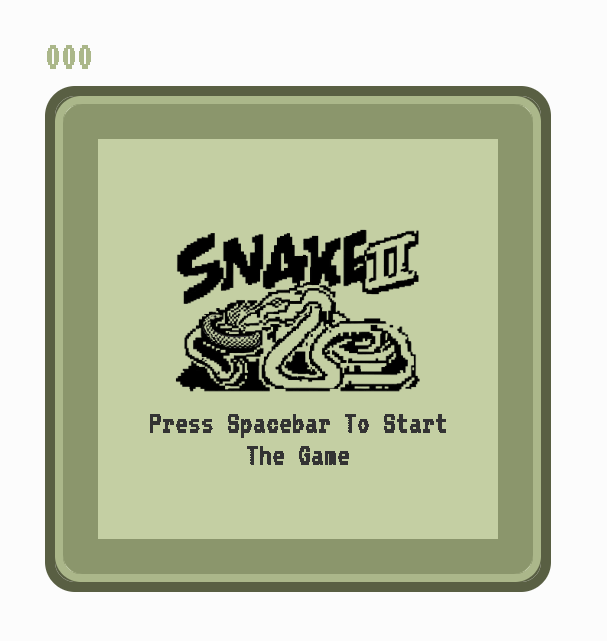
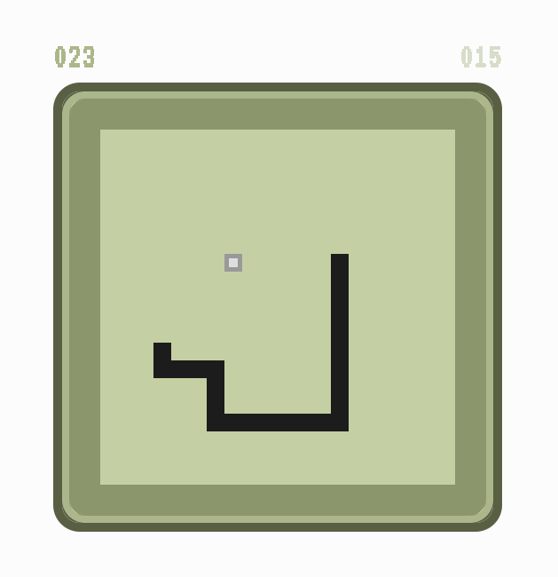

# Snake Game

## About
This repository contains a basic implementation of the classic Snake Game using only HTML, CSS, and JavaScript. The game is inspired by the work of user [Ade-mir](https://github.com/Ade-mir) and their [repository](https://github.com/Ade-mir/snake-game-js). The Snake Game is a timeless classic that challenges players to control a snake, guiding it to eat food and grow longer while avoiding collisions with itself and the boundaries of the game area.

## Objective
The main objective of this project is to create a functional Snake Game using minimalistic web technologies to provide a simple and enjoyable gaming experience.

## Features
- Classic Snake gameplay where the player controls a snake to eat food and grow longer.
- Simple and intuitive controls using arrow keys.
- Score tracking to monitor player progress.
- Game over detection when the snake collides with itself or the boundaries.

## Technologies Used
- HTML: For the structure and layout of the game.
- CSS: For styling and visual enhancements.
- JavaScript: For game logic and interactivity.

## Preview

